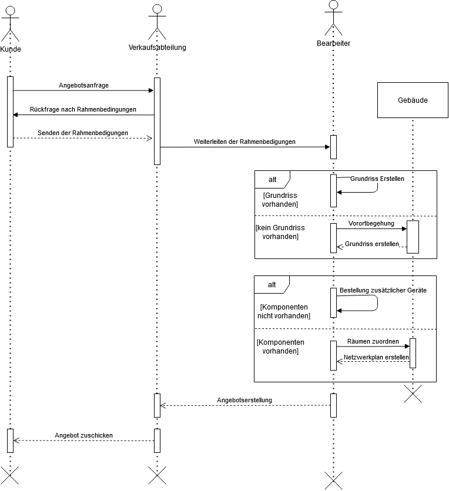

## Projekt IT Installation 
## Lernfeld 8


# Phase 1: Anwendungsfalldiagramm


# Phase 2: Einrichtung der gemeinsamen Dokumentenablage
Für die Zusammenarbeit wird die Plattform GitHub genutzt. Jedes Teammitglied erstellt sich ein Nutzerprofil, um über die Plattform arbeiten zu können. 

Es wird ein privates Repository auf der GitHub – Plattform erstellt. Jedes Teammitglied wird zur Mitarbeit eingeladen („*Contributor*“). Damit erhält jeder Lese- & Schreibzugriff.

Sofern notwendig wird Git auf der lokalen Maschine installiert und eingerichtet.

Das leere Repository wird mit `git clone` lokal bereitgestellt. Damit ersparen wir uns das Erstellen eines lokalen Repos und das Verbinden mit dem Remote. Die Bisher erstellen Dateien werden in den lokalen Ordner kopiert.
Es erfolgt ein Init-Commit, um die Dateien in das Remote-Repository zu laden
```
git clone <repo>
git add -A
git commit -m „init“
git push
```
Jedes Mitglied kann nun die Dateien per `git clone` abrufen und am Projekt von seinem System aus arbeiten.


# Phase 3: Sequenzdiagramm


# Phase 4: MKDocs 
Um einen eigenen kleinen MKDocs Server zu erstellen, haben wir eine Virtuelle Maschine mit CentOS 9 aufgesetzt.
Die Installation von MKDocs auf den Server konnte mit wenigen Befehlen gemacht werden.
Als erstes haben wir überprüft und sichergestellt, dass Python und der Python Paket Manager (PIP) auf dem Server vorhanden waren.
Da Python auf den meisten Linux Distributionen vorinstalliert ist, konnten wir direkt mit der Installation von MKDocs starten.
Um mit PIP neue Pakete abrufen zu können, mussten wir jedoch noch schnell den Schul-Proxy hinzufügen. 
Dies haben wir wie folgt getan:
```
set http_proxy=http://kjs-03.lan.dd-schulen.de:3128
```
Danach war der Proxy eingebunden.


Wir haben mit 
```
python -m pip install mkdocs mkdocs-material
```
die MKDocs Bibliothek installiert. 

Durch die Befehlszeile von MKDocs, konnten wir mit 
```
mkdocs new projekt_it_installation
``` 
ein neues Projekt anlegen.


Da
